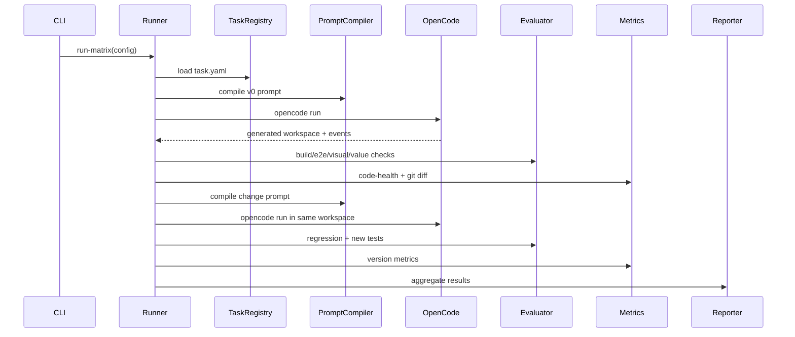

# System Architecture — Node.js/TypeScript

## 1. Архитектурная цель

Система должна запускать воспроизводимые benchmark-траектории:

```text
create workspace → generate v0 → evaluate → apply change → evaluate → repeat → score → report
```

Runner должен быть достаточно простым, чтобы его можно было реализовать за несколько дней, но структура должна позволять позже добавить новые модели, задачи, артефакты, judge-пайплайны и UI.

## 2. Технологический стек

Рекомендуемый стек:

```text
Runtime: Node.js 22+
Language: TypeScript
Package manager: pnpm
Generated app scaffold: Vite + React + TypeScript
E2E/visual testing: Playwright
Static metrics: ESLint, jscpd, dependency-cruiser, ts-prune or equivalent
Version tracking: git per workspace
Storage: filesystem + JSONL/CSV for MVP; SQLite/DuckDB optional later
Reports: Markdown + JSON + CSV
```

## 3. Высокоуровневые компоненты

```text
packages/
  runner/
  opencode-adapter/
  task-registry/
  prompt-compiler/
  evaluator/
  metrics/
  jury/
  reporter/
  shared/
```

### 3.1 runner

Отвечает за orchestration:

```text
- читает matrix config;
- создаёт workspaces;
- запускает initial generation;
- запускает evolution steps;
- вызывает evaluator;
- сохраняет результаты;
- управляет retries/repair attempts;
- пишет event log.
```

### 3.2 opencode-adapter

Обёртка над OpenCode CLI:

```text
- формирует команду opencode run;
- передаёт prompt;
- подключает файлы через --file;
- задаёт --dir, --model, --format json, --auto;
- парсит JSON events;
- извлекает token usage, session id, errors;
- сохраняет raw stdout/stderr.
```

### 3.3 task-registry

Загружает задачи из `tasks/<task_id>/task.yaml`:

```text
- reference assets;
- prompt arms;
- test paths;
- evolution steps;
- scoring weights;
- allowed dependencies;
- source/license metadata.
```

### 3.4 prompt-compiler

Собирает полный prompt из частей:

```text
- system prompt arm;
- user prompt arm;
- task spec;
- acceptance criteria;
- semantic UI tree;
- expected values;
- constraints;
- edit prompt;
- current version summary;
- current failing tests, если repair attempt.
```

### 3.5 evaluator

Запускает проверки:

```text
- dependency install check;
- build check;
- runtime smoke check;
- Playwright e2e;
- Playwright visual snapshots;
- value assertions;
- accessibility smoke check;
- console error check.
```

### 3.6 metrics

Считает метрики кода и diff:

```text
- LOC total;
- largest file LOC;
- changed files;
- changed lines;
- duplication ratio;
- cyclomatic complexity violations;
- dependency cycles;
- unused exports;
- dependency count;
- bundle size, optional.
```

### 3.7 jury

Готовит внешнюю оценку:

```text
- anonymized jury packet;
- screenshots;
- app preview instructions;
- checklist;
- pairwise comparison items;
- CSV/JSON import of human feedback;
- judge agreement metrics.
```

### 3.8 reporter

Генерирует:

```text
- report.md;
- scores.csv;
- result.jsonl;
- leaderboard.md;
- lifecycle curves as CSV;
- jury validation report.
```

## 4. Sequence flow



## 5. Filesystem layout

```text
app-benchmark/
  configs/
    mvp.yaml
    local.yaml

  tasks/
    todomvc/
    conduit-lite/
    dashboard-lite/
    boardly-kanban/

  prompts/
    system/
    user/
    edit/

  scaffolds/
    vite-react-ts/

  runs/
    2026-07-08_ape_mvp_001/
      matrix.yaml
      events.jsonl
      results.jsonl
      scores.csv
      report.md
      workspaces/
        <trajectory-id>/
      artifacts/
        <trajectory-id>/
          v0/
          v1/
          v2/
      jury-packet/
```

## 6. Workspace lifecycle

Для каждой trajectory:

```text
1. Copy scaffold into workspace.
2. git init.
3. git commit: scaffold.
4. Run v0 generation.
5. git diff → save.
6. git commit: v0-generated, если build проходит или если raw artifact нужно сохранить.
7. Evaluate.
8. For each evolution step:
   - run edit prompt;
   - save diff;
   - evaluate;
   - commit version;
   - mark failed/dead if thresholds reached.
```

## 7. Состояния version run

```text
queued
running_generation
generation_failed
build_failed
tests_failed
metrics_failed
passed
repairing
dead
skipped_due_to_parent_failure
```

## 8. Repair attempts

MVP допускает 0–1 repair attempt на версию.

Правило:

```text
Если build failed или critical e2e failed, runner может дать модели compact failure report и попросить исправить без изменения scope.
```

Сохранять отдельно:

```text
- original generation tokens;
- repair tokens;
- original diff;
- repair diff;
- final status.
```

## 9. Конкурентность

MVP:

```text
concurrency = 1..3
```

Важно не перегрузить free модели и не нарушить rate limits.

Каждый workspace должен быть изолирован директориями. Позже можно добавить Docker isolation.

## 10. Ошибки и устойчивость

Каждый шаг пишет event:

```json
{
  "timestamp": "2026-07-08T12:00:00.000Z",
  "trajectory_id": "todomvc__deepseek__U3__run1",
  "version": "v2",
  "phase": "e2e",
  "status": "failed",
  "duration_ms": 18322,
  "error": "Todo count did not update"
}
```

Runner не должен падать из-за одного failed run. Он должен пометить trajectory и продолжить матрицу.

## 11. Extensibility hooks

Позже можно добавить:

```text
- Docker sandbox per trajectory;
- web dashboard;
- remote runners;
- Figma import;
- VLM judge;
- database storage;
- statistical test module;
- model adapters beyond OpenCode;
- GitHub Actions integration.
```
